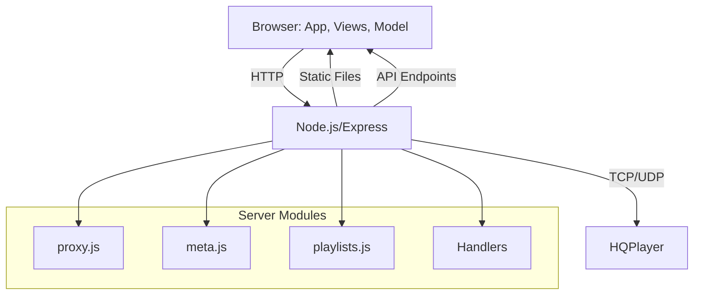

# HQPWV Architecture Documentation

## Overview

HQPWV (HQ Player Wave - formerly known as Web Viewer) is a web-based remote control for HQPlayer, featuring a Node.js/Express backend and a vanilla JavaScript frontend. The backend manages communication with HQPlayer and metadata, while the frontend provides a responsive user interface for browsing, controlling playback, and managing playlists.

---

## Directory Structure (Key Components)

```
server/           # Node.js backend (Express server, HQPlayer proxy, metadata, playlists)
  server.js       # Main server entry point
  proxy.js        # Handles TCP/UDP to HQPlayer
  meta.js         # Metadata management
  playlists.js    # Playlist file management
  ...             # Command/meta/playlist handlers, logging

www/              # Frontend (HTML, JS, CSS, assets)
  index.html      # Main HTML entry point
  app.js          # App bootstrap, event wiring
  service.js      # API communication, command queue
  model.js        # Centralized app state
  meta-util.js    # Metadata fetching/management
  commands.js     # XML command construction
  ...             # Views, utilities, CSS, images, libraries

hqpwv-metadata.json  # Persistent metadata storage
package.json         # Project dependencies and scripts
```

---

## Component Relationships

- **Frontend** ([www/app.js](www/app.js)) initializes the app, creates views, and manages state via the model.
- **Service** ([www/service.js](www/service.js)) sends API requests to the backend and updates the model.
- **Model** ([www/model.js](www/model.js)) holds app state, triggering UI updates.
- **Server** ([server/server.js](server/server.js)) routes API requests to handlers, which interact with HQPlayer (via proxy) or metadata (via meta.js).
- **Handlers** process commands, metadata, and playlist requests.
- **HQPlayer** is controlled by the server via TCP/UDP.

---

## API Endpoints

- `/endpoints/command` — Proxy XML commands to HQPlayer
- `/endpoints/meta` — Provide metadata (info, data, download)
- `/endpoints/native` — Native operations (open folder, get info)
- `/endpoints/playlist` — Playlist management
- Static files served from `/www`

---

## Structural Diagram (Mermaid)



---

## How to Extend

- **Add a new view:** Create a JS file in `www/`, update `app.js` to register the view.
- **Add a server endpoint:** Add a handler in `server/`, update `server.js` to route requests.
