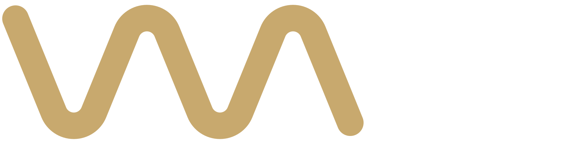

   

HQ Player Wave is a local webserver that allows you to remotely control [HQPlayer](https://www.signalyst.com/consumer.html)  from any device on your network using a web browser.

Thanks to [Zeropointnine](https://github.com/zeropointnine) for this excellent program! I added a few new features and redesigned the interface. It was vibe-coded 99%!

[Discussion thread on audiophilestyle](https://audiophilestyle.com/forums/topic/63831-hqpwv-hqplayer-web-viewer)

# HQPWV End-User Instructions

HQPWV is a local webserver that allows you to remotely control <a href="https://www.signalyst.com/consumer.html" target="_blank">HQPlayer</a> from any device on your network using a web browser.

# Requirements

1. <a href="https://www.signalyst.com/consumer.html" target="_blank">HQPlayer 4</a>
2. MacOS, Windows (64-bit), or Linux (64-bit)
3. A modern desktop or mobile browser, connected to your local network
   (If using desktop or mobile Safari, it must be a recent version, circa April 2021)

# Setup

1. Get the latest (unsigned) MacOS, Windows, or Linux executable [here](https://github.com/zaum/hqpwave/releases). Instructions for running unsigned binaries on MacOS can be found [here](https://support.apple.com/guide/mac-help/open-a-mac-app-from-an-unidentified-developer-mh40616/mac). If running an unsigned executable is not an option, consider downloading the source code and run the application using Node.js.
2. Make sure HQPlayer is running, and that your library is populated. Verify that the "Allow control from network" button is checked.
3. Run `hqpwv-server`. Running it from the same computer as HQPlayer itself is recommended, but not required.
4. If all goes well, the console output should give you a webpage url to navigate to (eg, something like`http://192.168.X.XXX:8000`).
5. Navigate to the url from any desktop or mobile browser that's on the same network as HQPlayer and HQPWV.

# Development setup

1. `cd` to the project directory.
2. Make sure Node.js is installed. Then enter:
   `npm install`.
3. Make sure [HQPlayer 4](https://www.signalyst.com/consumer.html) is running.
4. Start the server:
   `node server/server.js`
5. Browse to the locally served webpage as directed.

Executables are generated with `pkg` by simply entering:
`pkg .`

Front-end code consists of untranspiled, vanilla ES6 classes.

